# The fancy LaTeX thesis template

[](https://www.latex-project.org/)

This thesis was originally designed for bachelor's and master's theses at [Ulm University][sp-institute], but can be easily adapted to other universities and, e.g., doctoral dissertations.
This readme serves several purposes:

1. [Setting Up](#setting-up):\
   Explain how you can set up your own thesis repository based on this template
2. [Quickstart](#quickstart):\
   Give a quickstart explanation on how to get started writing your thesis (including [best practices](#best-practices))
3. [Full Reference](#full-reference):\
   Provide a more thorough reference of the commands and environments provided by the template

See the [ai-rules-uulm.md](./ai-rules-uulm.md) for the rules regarding the use of AI in theses specifically at Ulm University.

> Originally, I ([Florian][homepage]) created the basis of this template for my [bachelor's thesis][doi-ba] and minified it on request for my [master's thesis][doi-ma]. Even though I invested a lot of effort since then to make it standalone (and much, much, much easier to use), there are still some parts that are not as polished as they should be (and many modules not ported).
>
> If you encounter any problem, please write me an [email](mailto:florian.sihler@uni-ulm.de) or open an issue!
> The same holds for feature and documentation request, do not hesitate to open [a new issue][new-issue]!

## Setting Up

The main idea of using this thesis is in a clone-and-own fashion. So you may either

- fork ([GitLab](https://docs.gitlab.com/ee/user/project/repository/forking_workflow.html), [GitHub](https://docs.github.com/en/pull-requests/collaborating-with-pull-requests/working-with-forks/fork-a-repo)) this repository (or have it forked by your supervisor), or
- create a new repository ([GitLab](https://docs.github.com/en/github/getting-started-with-github/create-a-repo), [GitHub](https://docs.github.com/en/repositories/creating-and-managing-repositories/creating-a-new-repository)) initialized with this template.

We prefer forking, as it allows you to keep the history of the template and directly pull in changes from the template (if you want to).

In case you want to use this template as a submodule or within another directory (e.g., because you do not want a separate repository for the thesis) please see the [alternative setup](#alternative-setup) section below.

## Quickstart

The quickstart assumes you use the sample structure provided in this repository, including the sample files.

### Understanding the Structure

The template has the following structure, only the `thesis.cls` and the `_config` folder are essential for the template to work. The remaining files represent an example structure:

```text
/
| - thesis.tex      # The main file for your thesis
| - thesis.cls      # The document class for the thesis
| - segments/       # A place for the segments of your thesis
| - README.md       # This file
| - literature/     # A place for your bib file(s)
| - img/            # A place for your images
| - .latexmkrc      # The configuration for latexmk
| - .gitlab-ci.yml  # The CI/CD pipeline
| - .gitignore      # Standard gitignore
| - _config/        # The internals of this template
```

Please note that the segments are just a generic suggestion, it is probably best to discuss the best structure with your respective supervisor.

### Best Practices

It is up to you and your supervisor whether you want to use the structure provided in this template (especially with regard to the files in the [segments](segments/) folder).
In general, we block the `thesis.pdf` and a `signature` image (see the [declaration of authenticity](#declaration-of-authenticity) module) from being committed to the repository ([.gitignore](.gitignore)) and even if you rename that main file you should refrain from pushing compiled (blobs/) files to the repository to avoid cluttering it.
**However**, to persist your final state in an easily accessible way, we encourage you to (at least at the University of Ulm) upload the compiled version of your final and submitted thesis to this repository as well.
Please use the format `<Surname><Firstname>-<Type>.pdf` for the file name, where `<Type>` is either `BachelorThesis` or `MasterThesis` (e.g., `SihlerFlorian-MasterThesis.pdf`).

For more information on the actual submission, please consult your supervisor ([FAQ Page of Ulm University](https://www.uni-ulm.de/studium/pruefungsverwaltung/pruefungen-und-module-faq/)).

### Configuring Metadata

Everything of importance regarding metadata resides within the [thesis.tex](thesis.tex) file.
Right at the start, when loading the document class, you can set the `type` of thesis to either `bachelor-thesis` or `master-thesis`:

```latex
\documentclass[
   % ...
   type=bachelor-thesis, % master-thesis
   % ...
]{thesis}
```

Afterward, go to the "important metadata" section (which should start with the line `% == Important Metadata`) to set your

- title (`\title`, preferably in [title case](https://capitalizemytitle.com/)),
- name (`\author`),
- title image (`\titleimage`),
- supervisor(s) (`\supervisor`), and
- examiner(s) (`\examiner`)

Great, you should be now up and ready to write your thesis!
Look at the [most important commands](#most-important-commands) or the example segments (e.g., the [introduction](segments/introduction.tex)) to get started.

In case you want a multi-line title (or decide yourself where to break the title line), use the `\nl` command which inserts a newline at a point of your choosing (this still inserts proper spacing in the metadata).

### Most Important Commands

There is only a small number of commands that you should know when working with this theses, everything else is packaged in what we call _modules_ which you can load (`\ThesisModule`) if you want functionality and styling which was useful for thesis writers before you. These modules provide you with styled support for [glossaries](#glossary), [pseudocode](#pseudocode), [listings](#listings), and more (see the [included modules](#included-modules)).

- _Links:_\
  We use the [cleveref][] package to provide you with the `\cref` command for linking. So instead of `\label{marker}...\autoref{marker}` you can use `\label{marker}...\cref{marker}`. If you want to link to a specific section, you can use the `\link` command: `\link{sec:mysec}{Super Text}`. If you want to link to a specific section and do not want the link to be highlighted, you can use `\link*{sec:mysec}{Super Text}` ([hyper references module](#hyper-references)).
- _Chapters:_\
   Before each chapter, you can use `\setchaptertoc` to have a mini table of contents in the sidebar. After starting each `\chapter`, you can use `\csummary` to provide a summary of the chapter in the main table of contents ([chapter module](#chapters-and-minitocs)). Additionally, the `summary` environment is intended to be used at the start of every chapter to provide a short overview of what is to be presented in the chapter. This environment does minor space compensation and prohibits references from occurring in the sidebar (to avoid clutter).
- _Sidebar:_\
   This theses often writes into the sidebar, and you may find that unhelpful or annoying from time to time, you can use `\disablesidetrue` to disable all sidebar writing commands from now on (and `\disablesidefalse` to re-enable them). If you just want to disable it for a set of commands, you can also use `\noside{...}` ([marginpar module](#marginpars)).

Besides those, there are many others, for example, the [units module](#units) provides you with a nice and easy way to typeset SI units.

## Full Reference

Below you can find various more thorough references to the commands and environments provided by the template.

### Alternative Setup

_These are currently untested so please let me know if you encounter any problems._

#### Using a Submodule

If you use this thesis as a submodule, you can update it using the following command:

```bash
git submodule update --remote --merge <path/to/the/submodule>
```

To get started, you probably should copy several files and folders, essentially everything except the [thesis.cls](thesis.cls) file and the [_config](_config/) folder which compromise the template itself.
Now adapting the path the loaded document class, setting the `\thesisProfilesPath{...}` should be enough to get the template to work (yet, depending on what you copy, setting the `configpath` document class option may suffice too, see the [common module](#the-common-module) for more information).

#### Working from a Different Directory

If you move the complete template to your own directory, there is technically nothing that has to be changed!

You just may want to update the [.gitlab-ci.yml](.gitlab-ci.yml) file (moving it to the root folder and changing the working directory within) so it is still in effect and builds the thesis for you. To have the link to the latest build in the readme work, you should update the path to reflect wherever the build is stored.

If you still want to receive updates there is no "automated" way, so you probably have to do it via patches.
You can create a [patch](https://git-scm.com/docs/git-apply) from the template repository using `git diff > myPatch.patch` and apply it to your repository using `git apply myPatch.patch`.


### Building the Thesis

Please note, that you require `perl` to compile the document if you want to have a glossary (it should be part of texlive). The `makeglossaries` command does not work without it.

#### Using LaTeX (default)

Any (pdf-)LaTeX compiler should have no problem in compiling the document (even if that is in the context of the [LaTeX Workshop](https://marketplace.visualstudio.com/items?itemName=James-Yu.latex-workshop) extension for [VS Code](https://code.visualstudio.com/) or the [TeXStudio](https://www.texstudio.org/) editor). For ease of use, we have included a [`.latexmkrc`](.latexmkrc) for the [latexmk](https://ctan.org/pkg/latexmk) to compile the document.
With it, simply running `latexmk` should give you the thesis, `latexmk -c` should perform a (small) cleanup and `latexmk -pvc` should continuously compile the document (useful for live previews). If at any point you need to force a recompile, either use `latexmk -g` or `latexmk -gg` to retry.

#### How to Use LuaLaTeX

The thesis offers built-in support for LuaLaTeX (although _pdflatex_ is recommended and the priority) and it is up to you to change the respective engine within your IDE. For the [`.latexmkrc`](.latexmkrc) you should update the _pdf mode_ from `$pdf_mode = 1;` to `$pdf_mode = 4;`.

### Adapting for other Universities or Institutes

The template provides a `profile` option for the document class, which defaults to `uulm-sp` (at the time of writing this is the only option that works).
This corresponds to a similarly named folder in [_config/profiles](./_config/profiles) which contains the specific settings for the specific university (logo, coloring, configuration overwrites, titlepage, ...).
So if you want to make your own definitions, it is probably best to clone-and-own this folder, adapt the settings to your needs, and then set the profile in the document class to your profile. If you want this to remain reusable, feel free to contribute your profile to this repository.

### Included Modules

Most modules are more and less modular so while they may rely on the built-in set, most of them should be adaptable outside of the thesis context. In the following list you can see which modules are included by default (✓) and what they provide.
You can load the other modules by using, for example, `\ThesisModule{authenticity}` command in the preamble of your document (the sample structure should load some of those for you). If you have something that you want to contribute, feel free to open a pull request!

|     | Module                                                      | Description                                                                       | (Internal) Source                                     |
|:---:|:----------------------------------------------------------- |:--------------------------------------------------------------------------------- |:----------------------------------------------------- |
|  ✓  | [\<Common>](#the-common-module)                             | Common commands for the thesis                                                    | [thesis.cls](thesis.cls)                              |
|     | [Declaration of Authenticity](#declaration-of-authenticity) | Provide a page to sign that you created this thesis of your own work              | [authenticity.tex](_config/internal/authenticity.tex) |
|  ✓  | [Bibliography Support](#bibliography-support)               | Provide support for a bibliography                                                | [biblatex.tex](_config/internal/biblatex.tex)         |
|  ✓  | [Chapters and Minitocs](#chapters-and-minitocs)             | Styles the chapters, their summaries, and tocs                                    | [chapter.tex](_config/internal/chapter.tex)           |
|  ✓  | [Colors](#colors)                                           | Provide a set of colors for the thesis                                            | [colors.tex](_config/internal/colors.tex)             |
|  ✓  | [Useful Environments](#useful-environments)                 | Provide a set of hopefully useful environments (abstract, acknowledgements, ...)  | [environments.tex](_config/internal/environments.tex) |
|  ✓  | [Floats](#floats)                                           | Configure the styling of floating elements (figures, ...) including their counter | [floats.tex](_config/internal/floats.tex)             |
|  ✓  | [Fonts](#fonts)                                             | Configure the fonts used in the thesis                                            | [fonts.tex](_config/internal/fonts.tex)               |
|  ✓  | [Footnote](#footnote)                                       | Footnotes that appear in the sidebar                                              | [footnote.tex](_config/internal/footnote.tex)         |
|     | [Glossary](#glossary)                                       | Provide support for a glossary                                                    | [glossary.tex](_config/internal/glossary.tex)         |
|  ✓  | [Headers and Footers](#headers-and-footers)                 | Configure the headers and footers                                                 | [headfoot.tex](_config/internal/headfoot.tex)         |
|  ✓  | [Hyper References](#hyper-references)                       | Configure the hyper references                                                    | [hyperref.tex](_config/internal/hyperref.tex)         |
|  ✓  | [General Layout](#general-layout)                           | Configure the general layout (including widow handling)                           | [layout.tex](_config/internal/layout.tex)             |
|  ✓  | [Licensing](#licensing)                                     | Provide license information                                                       | [license.tex](_config/internal/license.tex)           |
|     | [Listings](#listings)                                       | Provide support for code snippets (using the [xlistings][] backend)               | [listings.tex](_config/internal/listings.tex)         |
|  ✓  | [Margin Paragraphs](#margin-paragraphs)                     | Configure the content of the margin                                               | [marginpar.tex](_config/internal/marginpar.tex)       |
|  ✓  | [Page Layout](#page-layout)                                 | Configure the page layout                                                         | [page.tex](_config/internal/page.tex)                 |
|     | [Pseudocode](#pseudocode)                                   | Provide support for pseudocode                                                    | [pseudocode.tex](_config/internal/pseudocode.tex)     |
|  ✓  | [Tables](#tables)                                           | Configure the styling of tables                                                   | [tables.tex](_config/internal/tables.tex)             |
|  ✓  | [Titlepage](#titlepage)                                     | Styling for the titlepage                                                         | [titlepage.tex](_config/internal/titlepage.tex)       |
|  ✓  | [Translations](#translations)                               | Provide translation support for the template/document                             | [translations.tex](_config/internal/translations.tex) |
|     | [Units](#units)                                             | Provide support for (si-)units                                                    | [units.tex](_config/internal/units.tex)               |

#### The Common Module

The common module resides directly within the main [thesis.cls](thesis.cls) file and provides the basic functionality (document class options, loading of modules, ...). We list the document class options below.
As we are based on the [Koma-Script][koma] class [scrbook][koma], you can use all options provided by this class together with the [scrhack][koma] and [scrwfile][koma] package. Everything provided by [etoolbox](https://ctan.org/pkg/etoolbox) is also available.

<details>
<summary>All Document Class Options</summary>

Of course, not all options are equally important. Those of importance are at the top of the list:

| Option            | Default       | Description                                                                                                                                    |
|:----------------- |:------------- |:---------------------------------------------------------------------------------------------------------------------------------------------- |
| `citeInMarginpar` | true          | If set to false, citations will not appear in the marginpar (see [bibliography support](#bibliography-support)).                               |
| `draft`           | false         | If set to true, the document will be compiled in draft mode (showing overfull boxes, ...).                                                     |
| `enhanceMath`     | true          | Load advanced math fonts (see [fonts](#fonts)).                                                                                                 |
| `license`         | CCBY          | The license to use for the document (see [licensing](#licensing)).                                                                             |
| `pageInFloatRef`  | true          | This automatically activates the effects of the [floats module](#floats). If you set this to `false` you get the default LaTeX numbering.      |
| `profile`         | uulm-sp       | The profile to use for the document (see the [profiles](#adapting-for-other-universities-or-institutes)).                                      |
| `type`            | master-thesis | The type of the thesis (either `bachelor-thesis` or `master-thesis`).                                                                          |
| `verbose`         | false         | If set to true, the document will be compiled in verbose mode (showing more information in the log and more detailed error messages).          |
| ---------------   | ---------     | ------------------------------------------------------------------------------------------------------------------------                       |
| `beramono`        | true          | If set to false, the document will be compiled without the beramono font (see [fonts](#fonts)).                                                |
| `configpath`      | _config       | The path to the configuration files (relative to the main document).                                                                           |
| `digital`         | false         | This complements the print option, if set to true, the document will be compiled in digital mode.                                              |
| `fira`            | true          | If set to false, the document will be compiled without the fira font (see [fonts](#fonts)).                                                    |
| `fontsize`        | 10pt          | The font size of the document (only change when agreed with your supervisor).                                                                  |
| `hyperref`        | true          | If set to false, the document will be compiled without hyper references (complements `nohyperref`, see [hyper references](#hyper-references)). |
| `nohyperref`      | false         | If set to true, the document will be compiled without hyper references (complements `hyperref`, see [hyper references](#hyper-references)).    |
| `oneside`         | true          | If set to true, the document will be compiled in oneside mode (complements `twoside`).                                                         |
| `palatino`        | true          | If set to false, the document will be compiled without the palatino font (see [fonts](#fonts)).                                                |
| `paper`           | a4            | The paper size of the document (only change when agreed with your supervisor).                                                                 |
| `print`           | false         | If set to true, the document will be compiled in print mode (complements the digital option).                                                  |
| `rmtitle`         | true          | If set to false, the document will be compiled with a sans-serif title (see [fonts](#fonts), complements `sftitle`).                           |
| `sftitle`         | false         | If set to true, the document will be compiled with a sans-serif title (see [fonts](#fonts), complements `rmtitle`).                            |
| `twoside`         | false         | If set to false, the document will be compiled in oneside mode (complements `oneside`).                                                        |

<details>
<summary>Tree-View of these Options</summary>

The following shows the configuration options in a tree-hierarchy:

```mermaid
flowchart TD
    template(Template)
    
    template --- meta{{meta}}
    template --- layout{{layout}}
    template --- output{{output}}
    template --- font{{font}}
    template --- references{{references}}

    output --- target{{target}}
    output --- draft("`<code>draft</code>`")
    target --- print("`<code>print</code>`") 
    target --- digital("`<code>digital</code>`")

    meta --- license("`<code>license</code>`")
    meta --- profile("`<code>profile</code>`")
    meta --- type("`<code>type</code>`")
    meta --- verbose("`<code>verbose</code>`")
    meta --- configpath("`<code>configpath</code>`")

    layout --- citeInMarginpar("`<code>citeInMarginpar</code>`")
    layout --- paper("`<code>paper</code>`")
    layout --- pages{{pages}}
    pages --- oneside("`<code>oneside</code>`")
    pages --- twoside("`<code>twoside</code>`")

    font --- beramono("`<code>beramono</code>`")
    font --- fira("`<code>fira</code>`")
    font --- enhanceMath("`<code>enhanceMath</code>`")
    font --- fontsize("`<code>fontsize</code>`")
    font --- palatino("`<code>palatino</code>`")

    font --- title{{title}}
    title --- rmtitle("`<code>rmtitle</code>`")
    title --- sftitle("`<code>sftitle</code>`")
    
    references --- hyperlinks{{hyperlinks}} 
    hyperlinks --- hyperref("`<code>hyperref</code>`")
    hyperlinks --- nohyperref("`<code>nohyperref</code>`")
    references --- pageInFloatRef("`<code>pageInFloatRef</code>`")
```



</details>
</details>

Besides this, the common module provides some useful commands:

- `\ThesisModule{<name>}`: Load a module (if available) for the thesis.
- `\InputFrom{<path>}`: Add a path to the input path (so you do not have to specify it in the `\input` command). For example, `\InputFrom{segments}` allows you to use `\input{introduction}` instead of `\input{segments/introduction}`. This may also help when using the template as a [submodule](#using-a-submodule) or [from a different directory](#working-from-a-different-directory).

#### Declaration of Authenticity

_Include the [authenticity module](_config/internal/authenticity.tex) with `\ThesisModule{authenticity}`._

We usually require a declaration of originality/authenticity for the work conducted in the thesis. This module provides a page for you to sign that you created the presented work within this thesis of your own work.
The main macro `\makedeclarationofauthenticity` automatically inserts this page at the end of document, ready for you to be signed.
To digitally typeset the date and location, you can set them like this:

```latex
\setdeclarationlocation{Ulm}
\signaturedate{2025-12-30}
```

If you want to provide a digital signature too, you can use the `\signature` command:

```latex
\signature{path/to/signature.png}
```

> 📜 _Recommended Handling of Signatures_
>
> By default, the [.gitignore](.gitignore) excludes files like `signature.png` or `signature.jpeg`
> to prevent them from being accidentally committed to the repository.  So we recommend you name the signature file accordingly and place it in the root folder of the thesis:
>
> ```latex
> \signature{signature.png}
> ```
>
> If you choose to use a different name or location, you should update the [.gitignore](.gitignore) file accordingly. In general, do such things at the end of your thesis.


All in all the text we generate is just a suggestion, you can use the `declarationofauthenticity` environment to typeset your own text at a position of your choosing:

```latex
\begin{declarationofauthenticity}
   % Your text here
\end{declarationofauthenticity}
```

By default, we translate the `declaration-of-authenticity` string defined as part of the [translations module](#translations) to the respective language.
Please be aware, that you should use either the environment _or_ `\makedeclarationofauthenticity` but never both.

#### Bibliography Support

This module essentially provides the recommended package of [biblatex](https://ctan.org/pkg/biblatex) and [csquotes](https://ctan.org/pkg/csquotes) for the bibliography using [biber](https://ctan.org/pkg/biber) as the backend.
The common commands like `\addbibresource`, `\cite`, and `\printbibliography` work like normal but interplay with the margin (by default that is).
If you want bibliography support, but do not want cites to appear in the margin, you can set the document class option `citeInMarginpar` to false:

```latex
\documentclass[
   % ...
   citeInMarginpar=false,
   % ...
]{thesis}
```

Even without disabling this setting, this module provides you with the `\plaincite{...}` macro which does not write the citation in the marginpar (`\noside{...}` and `\disablesidetrue` work as well).
If on the other hand you want to willfully force a citation to appear in the sidebar, you can use the `\forcecite{...}` command. And, if you just want to have a cite appear in the marginpar, you can use the `\sidecite{...}` command.

As a side-effect, this module provides the `\enquote{...}` command by the [csquotes](https://ctan.org/pkg/csquotes) package which allows you to easily typeset texts within **c**ontext-**s**ensitive (and language dependent) quotes.

For more information, please see the documentation of the [biblatex](https://ctan.org/pkg/biblatex) and the [csquotes](https://ctan.org/pkg/csquotes) package.

#### Chapters and Minitocs

This module configures the look and feel of chapters, sections, and other structural elements of the document. Using the documentclass option `sftitle` allows an alternative take on this styling (which I personally dislike, but you may like it) using a sans-serif font for the titles. There are just a few new commands (you can use `\chapter`, `\section`, ... as usual):

- `\setchaptertoc` before a chapter will add a mini table of contents to the sidebar.
- `\csummary{...}` after a chapter will add a summary to the main table of contents. Within this summary, you can use the `\csumnext` macro to add a new line.

#### Colors

By default, this module provides the colors supplied by the [xcolor](https://ctan.org/pkg/xcolor) package. However, it is also responsible for loading the [profile-specific](#adapting-for-other-universities-or-institutes) colors (if available).
For an example, have a look at the color definition of the `uulm-sp` profile in the [_config/profiles/uulm-sp/colors.tex](_config/profiles/uulm-sp/colors.tex) file with its primary color `RGB(163,38,56)` (named `@primary`) for the [SP institute][sp-institute].

#### Useful Environments

Originally, this module provided much more, a huge collection of macros which the original author (me ✨) found useful in his thesis. However, as these require a lot of getting-used-to, they have been removed from this setup. What remains are four environments (which you can find in the aforementioned [master thesis](http://dx.doi.org/10.18725/OPARU-50107) as well):

- `abstract`: Provides an abstract section for the document.
- `acknowledgements`: Provides an acknowledgements section for the document.
- `conventions`: Provides a conventions section for the document.
- `rqs`: Provides a research questions enumerate list (which can be nested)

#### Floats

This module uses the [caption](https://ctan.org/pkg/caption) and the [subcaption](https://ctan.org/pkg/subcaption) package to configure the styling of floating elements (figures, tables, ...). It also provides the `subfigure` environment to group figures together.
For example, it causes figures and tables to follow a non-standard numbering scheme which uses the page number as well as the occurrence count of a float of that type on that page. While this sounds complicated, `Figure 13A` simply states that this is the first figure on page 13, `Figure 13B` would be the second, and so on (fight me on this being a much better naming scheme for floats).
If you (for whatever unfathomable reason) dislike this scheme, the [document class option](#the-common-module) `pageInFloatRef` can be set to false to revert to the default LaTeX numbering.
This still leaves you with the tools to register your own (see below), but disables the automatic hooks into the float environments.

You can use the float environments (`figure`, `table`, ...) as well as captions (`\caption`, ...) as usual. Usually we try to place captions for figures below the graphic, while we place captions before/above tables.

<details>
<summary>Figure Example</summary>

```latex
\begin{figure}
   \centering
   \begin{tikzpicture}
      \draw (0,0) -- (1,1);
   \end{tikzpicture}
   \caption[The Divider]{The great Divider of the Universe, separating the good from the bad.}
   \label{fig:divider}
\end{figure}
```

The caption will be the long version ("The great Divider of..."), while the list of figures will only show the short "The Divider" caption alternative. Within your document, you can refer to the figure using `\cref{fig:divider}` or `\namecref{fig:divider}` (which will print "Figure 13A" or "The Divider" respectively).

</details>

<details>
<summary>Table Example</summary>

```latex
\begin{table}
   \caption{A simple table}
   \begin{tabular}{cc}
      \toprule
      A & B \\
      \midrule
      1 & 2 \\
      3 & 4 \\
      \bottomrule
   \end{tabular}
   \label{tab:simple}
\end{table}
```

Usually, the caption is placed above the table, to take the role of a "title". Similar to the figure, you can refer to the table using `\cref{tab:simple}` or `\namecref{tab:simple}`.
See the [tables module](#tables) for more information on tables.

</details>

At the moment, we have no detailed guide about how you can register your own floats to the new page ref counting mechanism. In short, you have to use `\InitPageCounter{<float>}` with (ideally) the name of your floating environment, add a new hook which uses `\CountThisPage{<float>}{c@<float>@lb}` to count the floats at the beginning of the environment (usually with something like `\AtBeginEnvironment{<float>}{\HookCustomEnvCount{<float file ext>}{<page count hook>}}`) and provide a counter rendering (`\the<float>` which usually relies on `\@formatcounter`). The [pseudo](#pseudocode) module provides an example for this, registering the `pseudo` float (see the [pseudocode.tex](_config/internal/pseudocode.tex) file).

#### Fonts

This module, surprise, loads the default fonts used in this document and provides you with a semi-bold font-weight (accessible with the commands `\sbseries` and `\textsb{...}`).
By default, (and this is good believe me), we rely on [old-style figures](https://en.wikipedia.org/wiki/Text_figures) (also known as text figures) for numbers in the text. You can recognize them by the fact that they are not all on the same height and some of them even have depth (have a look at the `3` which hangs below the baseline).
If you do not like this (even only in a given scope), the `\LiningFigures` command switches to lining figures. As is usual, this happens automatically in tables (and math mode).
In case you require a lot of math, the `enhanceMath` document class option updates the `\mathcal` style.

If you are interested in the fonts used, have a look at the [fonts.tex](_config/internal/fonts.tex) file (they can be configured with the document class options `beramono`, `palatino`, and `fira`).

#### Footnote

This module simply causes footnotes to appear in the sidebar and to reset their count for each chapter. Additionally, footnotes should automatically backlink to the place where they were referenced.
As an (opinionated) addition, the module also provides the `\footurl{<url>}{<date>}` command to typeset a footnote with a URL and the date of access (which I personally find of importance):

```latex
See the website of ulm university\footurl{https://www.uni-ulm.de}{2024-12-24} % 🎄
```

Similarly, `\foothref{<url>}{<text>}{<date>}` can be used to create a footnote for, e.g., an archived link which shows shortened in the sidebar (if it is too long etc):

```latex
\foothref{https://web.archive.org/web/20241221140233/https://www.uni-ulm.de/}{https://www.uni-ulm.de/}{2024-12-21}
```

This will show only `https://www.uni-ulm.de/` in the sidebar but link to the web archive version.

#### Glossary

_Include the [glossary module](_config/internal/glossary.tex) with `\ThesisModule{glossary}`._

Combining the [glossaries-accsupp](https://ctan.org/pkg/glossaries-accsupp) and the [glossary-longragged](https://ctan.org/pkg/glossaries) package, this module provides (margin paragraph aware) support for glossaries. You can use all glossary commands as usual.

The default setup provides you with normal glossaries, acronyms, and symbols ("notation"),
have a look at the default [segments/glossary.tex](_config/segments/glossary.tex) file provided for sample definitions, and the [segments/introduction.tex](_config/segments/introduction.tex) file for a sample usage. Similar to the [bibliography module](#bibliography-support),
`\noside{...}` and `\disablesidetrue` can be used to prevent glossary entries from appearing in the marginpar. Additionally, `\sidesymbol{...}` can be used to place a symbol (only) in the marginpar. Especially to show multiple symbols we offer `\showsymbols{...,...,...}` (which may be followed by an optional star to force their appearance).

Besides those changes there is another, arguably opinionated change, which I (at least used to) feel relatively strongly about: custom replacement texts. If I have a glossary entry, for let's say "dataflow analysis" and I want to quote it in another context where "dataflow" suffices (e.g., in "dataflow and control flow analysis"), glossaries usually require you to either print the full term or to use one of their user fields to overwrite the text.
With this module, you can use brackets after the `\gls` command to overwrite the text: `\gls{dataflow-analysis}[dataflow]` will appear as a link named "dataflow" in the text, but still reference the full term in the glossary. While glossaries offers `\glslink` and `\glstext` for this purpose (and they should be readily available to you if you choose), I was never able to befriend them.

#### Headers and Footers

This module loads the [scrlayer-scrpage][] package of the [Koma-Script][koma] bundle and configures the `scrheadings` page styles, as well as the page number.
The module used to provide a lot of linking shenanigans, but currently they have been not ported (as there was no demand).

#### Hyper References

Hyper references allow you to link to other parts of the document or to external resources, and they may be disabled by setting the `hyperref` option to false or passing the `nohyperref` option to the document class (although, to be honest, I have not needed this option for a long time).

Loading the [hyperref][], [bookmark][], [hypcap][], [nth][], [varioref][], and [cleveref][] package, there is already a plethora of macros you can use (icons are enabled by [fontawesome][]):

- `\cref{<anchor>}`: The main reference command, use it instead of `\autoref` and `\ref` ([cleveref][]).
- `\href{<url>}{<text>}`: The usual href command ([hyperref])
- `\label{<anchor>}`: The usual label command.
- `\link{<anchor>}{<text>}`: A command to link to a specific section, the second argument is the text that should be displayed. If you do not want the link to be highlighted, you can use `\link*{<anchor>}{<text>}`.
- `\nth{<number>}`: The default ordinal number command by [nth][] (more or less a side effect of the ref styling).
- `\phantomsection`: A command to create a phantom anchor point (by default, a `\label` does not create an anchor and so, references to it will jump to the last anchor created).
- `\sideref{<anchor>}`: Essentially the command automatically issued by `\cref` to place the corresponding reference in the sidebar.
- `\url{<url>}`: The usual url command ([hyperref][] with the [url][] package).

The [footnote module](#footnote) additionally provides you with the `\footurl{<url>}{<date>}` and `\foothref{<url>}{<text>}{<date>}` commands to create footnotes with URLs and dates of access.

#### General Layout

This module primarily configures the skips for paragraphs, indentation, and how to deal with orphans, there are no new commands or environments of interest!

#### Licensing

This module provides the license banner line which can be used by the [titlepages module](#titlepage) to display the license of the document.
By default, we currently only offer the [CCBY](https://creativecommons.org/licenses/by/4.0/), [CCBYSA](https://creativecommons.org/licenses/by-sa/4.0/), [CCBYNC](https://creativecommons.org/licenses/by-nc/4.0/), and [CCBYNCSA](https://creativecommons.org/licenses/by-nc-sa/4.0/) licenses, but feel free to request whatever you desire.

To add a license the approach is relatively straightforward:

Go into the [license.tex](_config/internal/license.tex) file and add a new macro of name `\thesis@license@<LICENSE>`, you should already find a license like `\thesis@license@CCBY` there.
Then, the macro has to do two things: provide a translation for the `license` text (see the [translations module](#translations)) and provide the icons to be used by defining the macro `\thesis@license@symbols` (the [ccicons][] package is available to provide the icons).

#### Listings

_Include the [listings module](_config/internal/listings.tex) with `\ThesisModule{listings}`._

If you load the listings module you gain all features provided by the [xlistings][] package, which in turn relies on the [listings][] package to provide you with a set of helpful commands to typeset code snippets. If you know [listings][] you are theoretically already set to go, however, there are some macros you should know about (besides advantages like automated highlighting of numbers and unselectable line numbers thanks to the [accsupp][] package):

- Load a language of your choice using `\LoadLanguages{<language>}` (e.g., `\LoadLanguages{R,java}`).
- A `minted` environment similar to that of the [minted][] package:

   ```latex
   \begin{minted}[autogobble]{R}
   x <- 3
   print(x)
   \end{minted}
   ```

- With `\xlstlangoverride{<lang>}{<keys>}` you get language sensitive overrides:

  ```latex
  \xlstlangoverride{R}{
      morekeywords={example,bexample},
      add to literate={:pi:}{\(\mathcolor{red}{\pi}\)}{1}
  }
  ```

- The `add to literate` key allows you to add new literates (i.e., replacements) for your listings.

- You can enable language indicator badges with `\xlstmintedwithlangbadge` (for all minted environments) or with `\BadgeNextListing{<lang>}` for the next listing!

The [xlistings][] package is part of this template under [./_config/xlistings.sty](./_config/xlistings.sty), if you want to update it for your template instance, you may want to use the [./_config/update_xlistings.sh](./_config/update_xlistings.sh) shellscript.

#### Margin Paragraphs

The margin paragraphs module has the base control of over the sidebar, using a combination of the [mparhack][] (fixes for marginpar), [ifoddpage][] (to detect page counts), and [ragged2e][] package (for improved ragged writing), as well as either the cheaper [marginnote][] package (if in `draft` mode) or the [scrlayer-notecolumn][] package (supports column breaks). Although we load this plethora of packages, there are just a couple of commands that you should know about:

- `\sidenote[<yshift>]{<content>}` typesets the content into the margin.\
  The starred variant `\sidenote*[<yshift>]{<content>}` relies on `\makenote*` when using the [scrlayer-notecolumn][] package and prevents the expansion of the content. These commands can be nested (which may appear accidentally) but may need additional passes to work, if you do not want nesting to appear, you can add a `\disablesidetrue` to the `\thesissidebarhook` (see below).
- `\setmarginfont{<font>}` to set the font and color used in the margin.\
  You can use `\marginfont` to access the current font (with [scrlayer-notecolumn][] there is technically the `notecolumn.marginpar` koma-font too, but this is not reliable with `draft` mode)
- `\noside{...}` disables `\sidenote`(s) commands in its argument\
  You can use this to suppress automatic margin comments as introduced by commands like glossary entries or citations.
- `\disablesidetrue` and `\disablesidefalse` can be used to disable and re-enable the margin comments in a region of your choice (even if this is the complete document)
- `\thesisinverseragged` can be used within the `\sidenote` content and reverses the automatic ragging of the text.
- `\thesissidebarhook` is a macro which contains something that is to be executed within every sidebar note and you may use either `\appto\thesissidebarhook{...}` or `\preto\thesissidebarhook{...}` to append or prepend content to the hook.

#### Page Layout

This module uses the [geometry][] package to configure the main layout of the thesis (papersize, ...), applying binding correction, margins, marginpar width, and the like.
There are no new interesting commands that you should know about(/use) and if there are no clear requirements by your university, it is recommended to leave the layout as is.

#### Pseudocode

_Include the [pseudocode module](_config/internal/pseudocode.tex) with `\ThesisModule{pseudocode}`._

This module relies on [algorithm2e][] to provide you with the capability to typeset pseudocode. As a side effect of registering a new `pseudo` float that you can use to that matter, it loads [float][] and [newfloat][] as well.
Doing that you can typeset an algorithm like the following, in the document, you can reference individual lines using `\AlgoLineRef{<label>}`:

```latex
\begin{pseudo}[tbp]
\caption{Sample Float Caption}
\label{fun:good-algo} % label to reference the algorithm
\begin{algorithm}[H] % typeset an algorithm within the pseudo float (use `H` to fix)
   \PreCode % for definitions before the actual algorithm
   \Input{x :: String}
   \Output{y :: String}
   \Output{z :: String}

   \StartCode % for the main algorithm
   \lIf{x \KwIs "hello"}{
      \label{alg:important-line}\Return{"world"}
   }
   \While{true}{yuo
      \If{y \KwIs "world"}{
         \Return{"hello"}
      }
   }
   \Return{"goodbye"}
\end{algorithm}
\end{pseudo}
```

#### Tables

We do not do a lot of magic with tables, besides what we configure in the [float](#floats) module. In short, we load the [array][], [booktabs][], [tabularx][], and [longtable][] packages providing you with great commands such as `\toprule`, `\midrule`, and `\bottomrule` to create beautiful tables. Please have a look at the respective package documentation (especially that for [booktabs][]) or have a look at the sample [introduction.tex](segments/introduction.tex) file.

#### Titlepage

The titlepage module defines the commands you can use to [configure metadata](#configuring-metadata) (`\examiner`, `\titleimage`, ...) and loads some packages useful when creating the titlepage ([graphicx][], [ragged2e][], [enumitem][], and [tabularx][]).
Yet, behavior wise there is not a lot of magic going on here.
We overwrite the `\maketitle` command (and extend it with an optional argument you can use to specify the page number your titlepage should have: `\maketitle[2]` starts with page 2).
Besides, this we provide the `full-titlepage` environment which may then be used by the profiles (see the [Adapting for Other Universities or Institutes](#adapting-for-other-universities-or-institutes) section and the [`profile` option](#the-common-module)).

If you want to know the details, see the [uulm-sp/titlepage.tex](_config/profiles/uulm-sp/titlepage.tex) file for an example of a titlepage configuration.

#### Translations

This module uses the [translator][] package to provide many translations for various strings throughout the document, automatically set to the language of your document. You can use the `\translate` command to access these translations, however, you probably do not have to.

#### Units

_Include the [units module](_config/internal/units.tex) with `\ThesisModule{units}`._

This module loads and configures [siunitx][] to provide you with a set of commands to typeset units and numbers (please read the [siunitx][] documentation for more information). In short, you can use `\qty{<number>}{<unit>}` to typeset a quantity, `\num{<number>}` to typeset a number, and `\unit{<unit>}` to typeset a unit. For example: `\qty{3.14}{\meter\per\second}`.

[accsupp]: https://ctan.org/pkg/accsupp
[algorithm2e]: https://ctan.org/pkg/algorithm2e
[array]: https://ctan.org/pkg/array
[bookmark]: https://ctan.org/pkg/bookmark
[booktabs]: https://ctan.org/pkg/booktabs
[ccicons]: https://ctan.org/pkg/ccicons
[cleveref]: https://ctan.org/pkg/cleveref
[doi-ba]: http://dx.doi.org/10.18725/OPARU-47275
[doi-ma]: http://dx.doi.org/10.18725/OPARU-50107
[enumitem]: https://ctan.org/pkg/enumitem
[float]: https://ctan.org/pkg/float
[fontawesome]: https://ctan.org/pkg/fontawesome
[geometry]: https://ctan.org/pkg/geometry
[graphicx]: https://ctan.org/pkg/graphicx
[homepage]: https://eagleoutice.github.io/portfolio/
[hypcap]: https://ctan.org/pkg/hypcap
[hyperref]: https://ctan.org/pkg/hyperref
[ifoddpage]: https://ctan.org/pkg/ifoddpage
[koma]: https://ctan.org/pkg/koma-script
[listings]: https://ctan.org/pkg/listings
[longtable]: https://ctan.org/pkg/longtable
[marginnote]: https://ctan.org/pkg/marginnote
[minted]: https://ctan.org/pkg/minted
[mparhack]: https://ctan.org/pkg/mparhack
[new-issue]: https://github.com/Fancy-Templates/latex-thesis/issues/new
[newfloat]: https://ctan.org/pkg/newfloat
[nth]: https://ctan.org/pkg/nth
[ragged2e]: https://ctan.org/pkg/ragged2e
[scrlayer-notecolumn]: https://ctan.org/pkg/scrlayer-notecolumn
[scrlayer-scrpage]: https://ctan.org/pkg/scrlayer-scrpage
[siunitx]: https://ctan.org/pkg/siunitx
[sp-institute]: https://www.uni-ulm.de/in/sp/
[tabularx]: https://ctan.org/pkg/tabularx
[translator]: https://ctan.org/pkg/translator
[url]: https://ctan.org/pkg/url
[varioref]: https://ctan.org/pkg/varioref
[xlistings]: https://github.com/EagleoutIce/xlistings